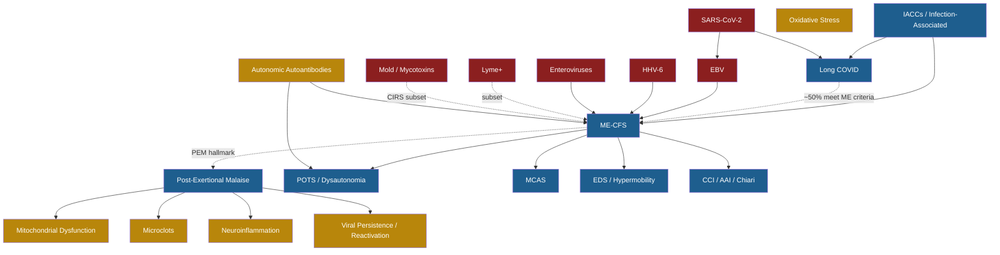

# ME/CFS + Long COVID Research Library

A queryable knowledge graph (~70 interlinked notes) covering [ME/CFS](ME-CFS.md), [Long COVID](Long%20COVID.md), and related infection-associated chronic illnesses: conditions, mechanisms, pathogens, treatments, and the researchers behind them.

The notes use Obsidian-style `[[wikilinks]]` so the network can be browsed in [Obsidian](https://obsidian.md), published as a digital garden via [Quartz](https://quartz.jzhao.xyz), or fed into an AI chat layer (e.g. NotebookLM, Claude, or a custom RAG app).

## Attribution

This is a **graph-structured restructuring** of the public Google Doc maintained by **Sarah Healing** ([@sarahhhhealing](https://www.instagram.com/sarahhhhealing/) on Instagram), a first-year MD student who has compiled and synthesized the research while sick herself. **All factual content, study citations, and clinical framings are hers.** This repo only adds the graph structure — splitting sections into linked nodes, tagging them, and rendering the connections.

If you find this useful, please follow and credit her work directly.

> **This is not medical advice.** Sarah is not a physician. The patient population this covers is sensitive — bring any intervention to a clinician before trying it.

## How to use

### As an Obsidian vault
1. Clone this repo
2. **Open Obsidian → Open vault → select the cloned folder**
3. Graph View (Cmd+G) shows the network; tag-based filters in the left panel let you slice by `type/X` or `system/X`

### As a digital garden (publish your own copy)
[Quartz 4](https://quartz.jzhao.xyz) is built for this exact use case (Obsidian vault → static site with graph + backlinks + search). Fork, point Quartz at this folder, deploy to GitHub Pages.

### As an AI knowledge base
The notes are plain Markdown — drop the folder into [NotebookLM](https://notebooklm.google.com), upload them to a [Custom GPT](https://chatgpt.com/gpts) or [Claude Project](https://claude.com/projects), or run any RAG pipeline (Pinecone/Chroma/Qdrant + embeddings) over the directory. The tag taxonomy below makes filtered retrieval clean (`tag:#class/antiviral`, etc.).

## Tag taxonomy

Every note has YAML frontmatter tags:

- **`type/`** — `condition` · `mechanism` · `pathogen` · `treatment` · `treatment-category` · `person` · `symptom` · `concept` · `index`
- **`system/`** — `mito` · `immune` · `neuro` · `autonomic` · `vascular` · `endocrine` · `connective` · `structural`
- **`class/antiviral`** — for antiviral treatments

In Obsidian, the tag pane (Cmd+P → "Show tag pane") gives you a clickable tree. In Graph View → Groups, you can color-code by tag.

## Coverage

71 content notes + this README:

| Category | Count | Examples |
|---|---|---|
| Conditions | 10 | [ME/CFS](ME-CFS.md), [Long COVID](Long%20COVID.md), [POTS](POTS.md), [MCAS](MCAS.md), [Fibromyalgia](Fibromyalgia.md), [CIRS](CIRS.md) |
| Symptoms / concepts | 2 | [Post-Exertional Malaise](Post-Exertional%20Malaise.md), [IACCs](IACCs.md) |
| Mechanisms | 8 | [Mitochondrial Dysfunction](Mitochondrial%20Dysfunction.md), [Neuroinflammation](Neuroinflammation.md), [Microclots](Microclots.md), [Autonomic Autoantibodies](Autonomic%20Autoantibodies.md), [Viral Persistence](Viral%20Persistence%20and%20Reactivation.md) |
| Pathogens | 7 | [SARS-CoV-2](SARS-CoV-2.md), [EBV](EBV.md), [HHV-6](HHV-6.md), [Enteroviruses](Enteroviruses.md), [Lyme+](Lyme%20Bartonella%20Babesia.md) |
| Treatment categories | 5 | [Antivirals](Antivirals.md), [Immunotherapy](Immunotherapy.md), [Mitochondrial Support](Mitochondrial%20Support.md) |
| Specific treatments | 25 | [Oxaloacetate](Oxaloacetate.md), [Methylene Blue](Methylene%20Blue.md), [LDN](Low%20Dose%20Naltrexone.md), [Rapamycin](Low%20Dose%20Rapamycin.md), [HBOT](HBOT.md), [SGB](Stellate%20Ganglion%20Block.md), [Ampligen](Ampligen.md), [Immunoadsorption](Immunoadsorption.md) |
| People | 15 | [Sarah Healing](Sarah%20Healing.md), [Dr Putrino](Dr%20Putrino.md), [Dr Chia](Dr%20Chia.md), [Dr Hanson](Dr%20Hanson.md), [Dr Younger](Dr%20Younger.md) |

## Graph overview

## Status and gaps

This is v1. Sections that are thin or "to be completed" in the source — vagus nerve stimulation, FMT, diet, brain retraining, hormones, sleep, monoclonal antibodies, triple anticoagulant therapy, antidepressants — are stubs or omitted here. PRs welcome.

Some notes that the network references but aren't yet expanded as their own files: Photobiomodulation (synonym placeholder for Red Light Therapy), individual supplement nodes (curcumin, quercetin, resveratrol, etc.), and individual key studies as separate nodes (Naviaux, Swank, Lyall, Eastep, etc.).

## License

[CC BY-SA 4.0](LICENSE). Source content credit to Sarah Healing. Attribution required; share-alike for derivative works.

## Contributing

Issues and PRs welcome — corrections, missing studies, additional treatments, expanded stubs. Please keep notes tight (1 page where possible), cite the source paper or person when adding claims, and add appropriate `type/` and `system/` tags.
