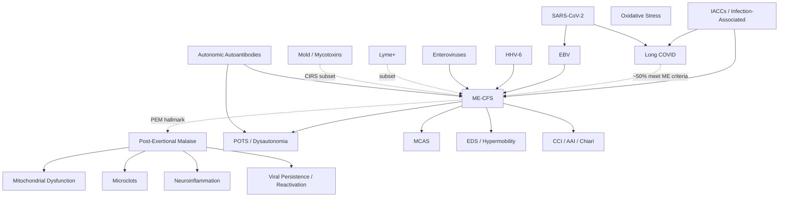

# Sarah Healing

> *@sarahhhhealing on Instagram. Medical student. Patient. Researcher.*

This site is a graph-structured presentation of the public ME/CFS + Long COVID research document maintained by **Sarah Healing** — a medical student who, while sick herself, has been compiling and synthesizing the literature into a working clinical reference for patients, caregivers, and physicians.

**All factual content, study citations, and clinical framings are hers.** This site just splits her work into ~70 interlinked notes, adds tags, and renders the network visually. If you find any of this useful, please:

- **Follow her on Instagram**: [@sarahhhhealing](https://www.instagram.com/sarahhhhealing/)
- **Read the original Google Doc** that this graph was built from (linked from her Instagram bio)
- **Credit her** when sharing or adapting

She posts video summaries most Thursdays and updates the source document regularly. This graph is a snapshot of her work as of 2026-05-28 — see her originals for the latest.

> [!warning] Not medical advice
> Sarah is a medical student, not a treating physician. The patient population this covers is sensitive to interventions — bring anything you read here to a qualified clinician before trying it.

---

> [!tip] 💬 Chat with this library
> Synthesize across notes using **[NotebookLM](https://notebooklm.google.com/notebook/65dbf737-6de4-4d61-bf8d-911f06ce97c8)** — ask questions like *"compare LDN and rapamycin for Long COVID"* or *"which interventions does Dr. Chia recommend for the enterovirus subset?"* and get cited answers.

## Browse Sarah's research

Sarah's document covers conditions, mechanisms, pathogens, treatments, and the researchers behind them — roughly the full landscape of infection-associated chronic illnesses ([[IACCs]]).

### Conditions
[[ME-CFS]] · [[Long COVID]] · [[Post-Exertional Malaise]] · [[POTS]] · [[Dysautonomia]] · [[MCAS]] · [[EDS Hypermobility]] · [[Craniocervical Instability]] · [[Fibromyalgia]] · [[CIRS]]

### Mechanisms
[[Mitochondrial Dysfunction]] · [[Oxidative Stress]] · [[Neuroinflammation]] · [[Viral Persistence and Reactivation]] · [[Microclots]] · [[HPA Axis Dysfunction]] · [[Autonomic Autoantibodies]] · [[Warburg Effect]]

### Pathogens
[[SARS-CoV-2]] · [[EBV]] · [[HHV-6]] · [[CMV]] · [[Enteroviruses]] · [[Lyme Bartonella Babesia]] · [[Mold Mycotoxins]]

### Treatments — categories
[[Mitochondrial Support]] · [[Antivirals]] · [[Immunotherapy]] · [[Anticoagulant Therapy]] · [[Nervous System Regulation]]

### Treatments — high-traffic specific nodes
[[Oxaloacetate]] · [[Methylene Blue]] · [[NAD Plus]] · [[Phosphatidylcholine]] · [[Red Light Therapy]] · [[HBOT]] · [[IVIG SCIG]] · [[Low Dose Naltrexone]] · [[Low Dose Rapamycin]] · [[Stem Cells]] · [[Stellate Ganglion Block]] · [[Ampligen]] · [[Immunoadsorption]] · [[Valacyclovir]] · [[Truvada]] · [[Maraviroc]] · [[Paxlovid]] · [[Remdesivir]] · [[Oxymatrine Equilibrant]] · [[Dihydroquercetin]] · [[Low Dose Abilify]]

### Researchers Sarah cites
[[Dr Putrino]] · [[Dr Chia]] · [[Dr Davis]] · [[Dr Klimas]] · [[Dr Liu]] · [[Dr Hanson]] · [[Dr Lerner]] · [[Dr Younger]]

## Sarah's personal protocol notes

A few things Sarah mentions trying in her own recovery:

- **IV [[Phosphatidylcholine]]** — reports ~20% improvement anecdotally
- **[[Red Light Therapy]]** — uses a small EMR-Tek panel daily
- General multi-element approach per the [[ME-CFS]] healing framework

## Tag taxonomy

Every note has YAML frontmatter tags. In the graph view, you can color-code by tag group; in the tag pane, the tree gives a clickable index.

- **`type/`** — `condition` · `mechanism` · `pathogen` · `treatment` · `treatment-category` · `person` · `symptom` · `concept`
- **`system/`** — `mito` · `immune` · `neuro` · `autonomic` · `vascular` · `endocrine` · `connective` · `structural`
- **`class/antiviral`** — for antiviral treatments

## Graph overview

## Use Sarah's content elsewhere

- **AI chat (this library):** [NotebookLM notebook](https://notebooklm.google.com/notebook/65dbf737-6de4-4d61-bf8d-911f06ce97c8)
- **As your own Obsidian vault:** clone the [GitHub repo](https://github.com/Gabe-Levin/me-lc-research-library), open `content/` as a vault
- **AI chat (custom):** the markdown is plain text — drop into Claude Projects, a Custom GPT, or any RAG pipeline

## License

[CC BY-SA 4.0](https://creativecommons.org/licenses/by-sa/4.0/). Source content credit to Sarah Healing. Attribution required; share-alike for derivative works.
